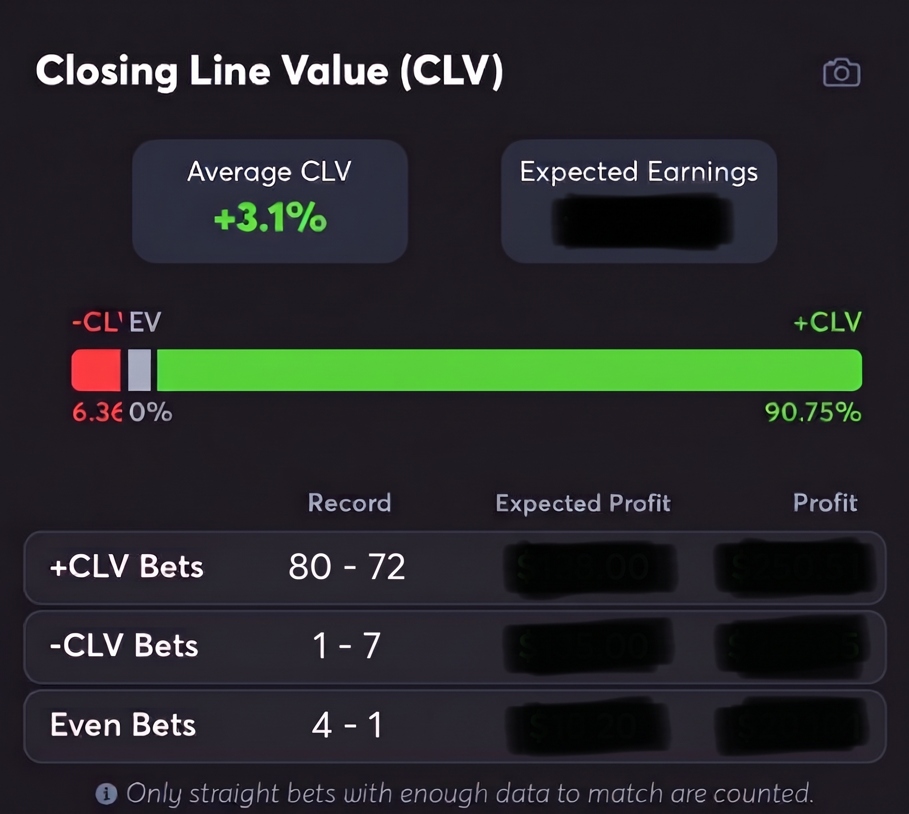

# Sports-Betting-Edge-Tool
This repository contains an in development bot that will place orders on kalshi based on what it deems has an expected edge.
## Overview

This document summarizes a manually built track record of beating the consensus closing line across four active months (December, January , July, August) within the past year. Average closing line value (CLV) was independently calculated as +3.10% by Juice Reel and +2.86% by Pikkit across the same 313 bets. I achieved this using line comparison and fair odds calculators. I have since built an automated system that will place and track these trades using the same process to scale it beyond what is possible manually

## Methodology

The manual process starts with comparing lines with OddsShopper’s odds screen to quickly compare a sharp sportsbook’s line, Pinnacle for most markets, to the platform I would be trading on. Next, I would set the sharp book line in OddsJam’s fair odds calculator to find the “true probability” of the line which is known as de-vigging. After obtaining the fair odds I place that and the line from the platform I place the bets on into a Kelly criterion calculator using ½ Kelly criterion to set my unit sizes. I use half-Kelly criterion to mitigate risk whilst still having an encouraging profit. Finally, I place the bets directly from OddsShopper’s odds screen.

## Sportsbooks vs Prediction Markets

I began using FanDuel as the primary book to bet on NBA player props. Over 109 bets I obtained an average CLV of +2.6%. As prediction markets became legal in more states, I pivoted to making trades on sites like Kalshi and Novig as they were more likely to have softer lines on MLB payer props based on previous research. This change made the average CLV jump to +3.28% over 204 placed trades. This increase could be accredited to factors such as more disciplined bet sizing, using a different sport with higher sample sizes, as well as participating in more volatile markets.

## Automated System

I built the initial skeleton with AI-assisted coding, then wrote and refined the core logic myself. The software the script is run on is VS Code using Python coding language. I set this code to only read pre-game markets to keep it consistent with my proven manual strategy. With it being created relatively recently it does not have a proven track record, but I am able to set the code to run in “paper mode” which means it tracks the trades its deemed to have positive expected value and does not make the transaction on the prediction market. A command can then be run to see the outcomes of all the bets placed.

## Issues/Next Steps

The main obstacle of this code was getting APIs to pull from multiple books and having those lines read accurately. The current implementation uses free-tier API access for odds data. This runs into issues such as a longer refresh delay and limits on how many market pulls can be executed per day. To improve this the next steps are establishing a live track record for the automated system and upgrading to a paid, lower-latency data feed.
